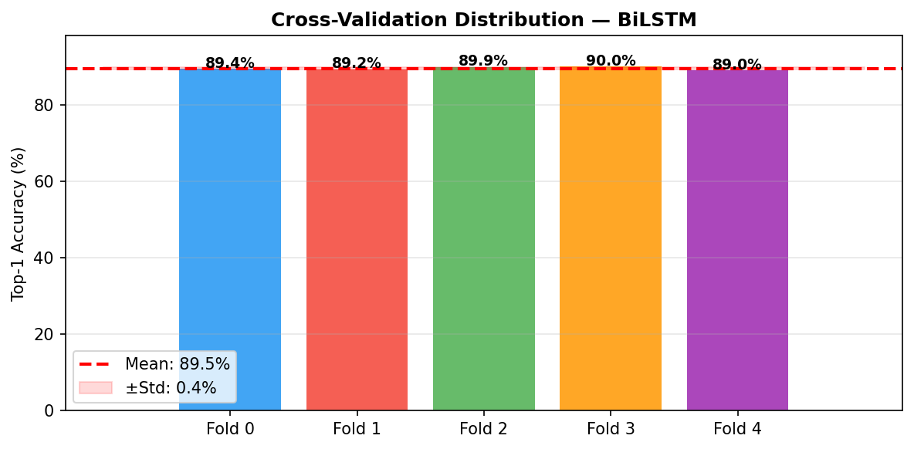
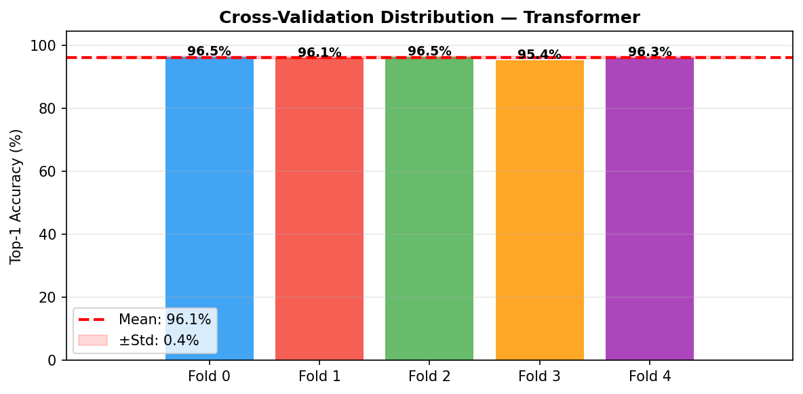

# Myanmar Sign Language (MSL) Recognition

## Overview

This project implements a MSL recognition system for emergency cases.

## Error-Free Workflow

- When using **Google Colab**:
    - During setup, dependency conflicts may occur due to different protobuf versions required by MediaPipe, TorchMetrics, W&B, and pre-installed Colab libraries.
        - Switching MediaPipe versions will not fix this as newer releases introduce breaking API changes that cause runtime errors in this codebase.
    - Extracting keypoints may cause the free-tier GPU runtime to become unavailable.
        - Extracting keypoints using a CPU runtime fix this.
        - Once the keypoints have been generated, switch to a GPU runtime for training or inference.
    - Note that switching runtimes resets the session and **deletes** any extracted keypoints stored in the runtime's temporary disk space. Therefore, save all extracted keypoints to Google Drive before changing runtimes.
    - The free-tier GPU quota resets **daily** and is shared across your Colab usage.
- When using a **local GPU**:
    - The Google Colab-specific issues described above do not apply.
    - Training time can range from a few hours to several days with limited GPU resources.
- When using **Kaggle**:
    - Note that switching runtimes resets the session, but **does not delete** any files stored in the runtime's temporary disk space.
    - The free-tier GPU quota resets **weekly**, with up to 30 hours of GPU time available.
- **Recommendation**:
    - Set up a virtual environment (venv) conditionally:
        - When?
            - **local GPU**: always set up venv.
            - **Google Colab / Kaggle**:
                - Do everything (extract keypoints, train, evaluate, and inference on cloud) $\rightarrow$ always set up venv because cloud runtimes hit protobuf and other dependency conflicts with MediaPipe, TorchMetrics, and W&B.
                - Only train and evaluate (extract keypoints locally, train and evaluate on cloud, inference locally) $\rightarrow$ no venv required.
        - How?
            - Install PyTorch manually.
            - Use `requirements.txt` to install the remaining libraries.
    - Prepare data locally (keypoint extraction, augmentation, and inference).
    - Use Kaggle rather than Colab for training and evaluation because Kaggle's weekly GPU quota (up to 30 hours) is more generous than Colab's daily limit.

## Experiments

1. **Exp-1** ([mslr_full_train_v1](notebooks/mslr_full_train_v1.ipynb)): Sayar's default configuration
2. **Exp-2** ([mslr_5cv_v1](notebooks/mslr_5cv_v1.ipynb)): Use K-fold cross-validation (K=5)

Summary: [presentation slides](presentation_slides.pdf)

Results:

| Eval on Validation Data | Eval on Test Data |
|:-------------:|:-----------:|
|  |  |


| 5-fold CV BiLSTM | 5-fold CV Transformer | 5-fold CV ST-GCN |
|:-------------:|:-----------:|:-----------:|
|  |  |  |

## Dataset

- [Sayar's annotation](https://github.com/ye-kyaw-thu/AIE-F/blob/main/slide-code/class-25/msl_recognition/data/annotations.txt)
- [Sayar's MSL4Emergency dataset](https://github.com/ye-kyaw-thu/MSL4Emergency/tree/master/msl4emergency-ver-1.0/video)

## File Structure
```
/
...
├── config/             # originally Sayar's # modified
├── data/
│   ├── videos/         # originally Sayar's
│   ├── keypoints/      # extracted keypoints by mediapipe
│   ├── augmented/      # augmented data # can be recreated from ./keypoints/
│   ├── sample4infer/   # sample videos from Sayar's dataset
│   └── annotations.txt # originally Sayar's
├── scripts/            # originally Sayar's # modified
├── src/                # originally Sayar's
│
├── notebooks/
├── wandb/
└── results/
    ├── exp_bilstm
    ├── exp_transformer
    ├── exp_stgcn
    ├── exp_cv_bilstm
    ├── exp_cv_transformer
    └── exp_cv_stgcn
```

## External URLs

- [Hugging Face Models](https://huggingface.co/lawun330/myanmar-sign-language-recognition)
- [Kaggle Datasets](https://www.kaggle.com/datasets/lawunnannda/msl4emergency-dataset-augmented-keypoints)
- [Wandb](https://wandb.ai/lawun330-/msl-recognition?nw=nwuserlawun330)

## References

- [In-Class Tutorial](https://github.com/ye-kyaw-thu/AIE-F/tree/main/slide-code/class-25/msl_recognition)

## Note

This project was done for educational purposes as an assignment for the AI Engineering Fundamentals class taught by [*Sayar Ye Kyaw Thu*](https://github.com/ye-kyaw-thu).
