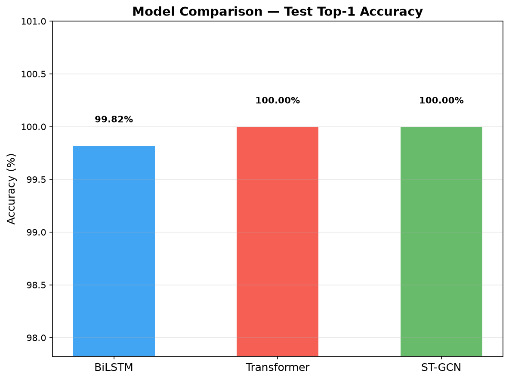

# Myanmar Sign Language (MSL) Recognition

## Overview

This project implements a MSL recognition system for emergency cases.

## Error-Free Workflow

- Always create a new virtual environment.
- Install PyTorch manually.
- Use `requirements.txt` to install the remaining libraries.
- When using **Google Colab**:
    - During setup, dependency conflicts may occur due to different protobuf versions required by MediaPipe, TorchMetrics, Weights & Biases (W&B), and pre-installed Colab libraries.
    - Extracting keypoints may cause the free-tier GPU runtime to become unavailable.
    - This issue can be avoided by extracting keypoints using a CPU runtime.
    - Once the keypoints have been generated, switch to a GPU runtime for training or inference.
    - Note that switching runtimes resets the session and deletes any extracted keypoints stored in the runtime's temporary disk space. Therefore, save all extracted keypoints to Google Drive before changing runtimes.
- When using a **local GPU**,
    - The Google Colab-specific issues described above do not apply.
    - Training time can range from a few hours to several days with limited GPU resources.
- It is recommended to prepare the data locally, including keypoint extraction and data augmentation. Google Colab should be used primarily for training, evaluation, and inference.

## Experiments

1. **Exp-1** (mslr_v1): Sayar's default configuration
2. **Exp-2** (mslr_v2): Use K-fold cross-validation

Wandb: https://wandb.ai/lawun330-/msl-recognition?nw=nwuserlawun330

Summary: [presentation slides](presentation_slides.pdf)

Results:

| Exp-1 on Validation Data | Exp-1 on Test Data |
|:-------------:|:-----------:|
|  |  |

| Exp-2 on Validation Data | Exp-2 on Test Data |
|:-------------:|:-----------:|
|  |  |

## Dataset

- [Sayar's annotation](https://github.com/ye-kyaw-thu/AIE-F/blob/main/slide-code/class-25/msl_recognition/data/annotations.txt)
- [Sayar's MSL4Emergency dataset](https://github.com/ye-kyaw-thu/MSL4Emergency/tree/master/msl4emergency-ver-1.0/video)

## File Structure
```
/
...
├── config/             # originally Sayar's # modified
├── data/
│   ├── videos/         # originally Sayar's
│   ├── keypoints/      # extracted keypoints by mediapipe
│   ├── augmented/      # augmented data # can be recreated from ./keypoints/
│   ├── sample4infer/   # sample videos from Sayar's dataset
│   └── annotations.txt # originally Sayar's
├── scripts/            # originally Sayar's # modified
├── src/                # originally Sayar's
│
├── notebooks/
├── wandb/
└── results/
    ├── exp_bilstm
    ├── exp_transformer
    └── exp_stgcn
```

## References

- [In-Class Tutorial](https://github.com/ye-kyaw-thu/AIE-F/tree/main/slide-code/class-25/msl_recognition)

## Note

This project was done for educational purposes as an assignment for the AI Engineering Fundamentals class taught by [*Sayar Ye Kyaw Thu*](https://github.com/ye-kyaw-thu).
